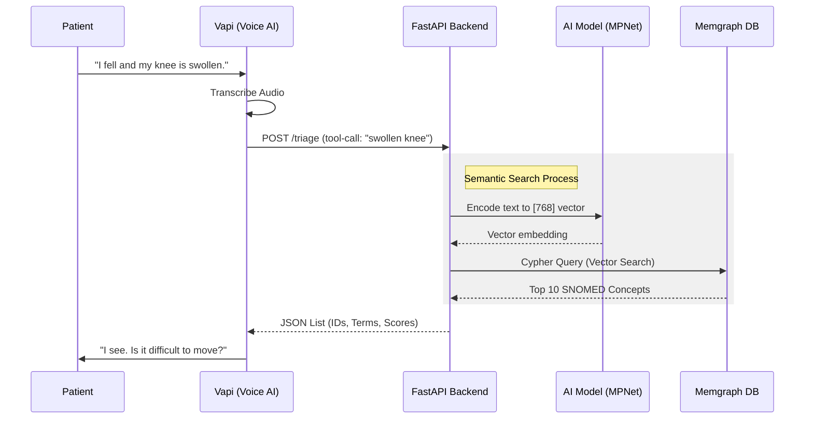
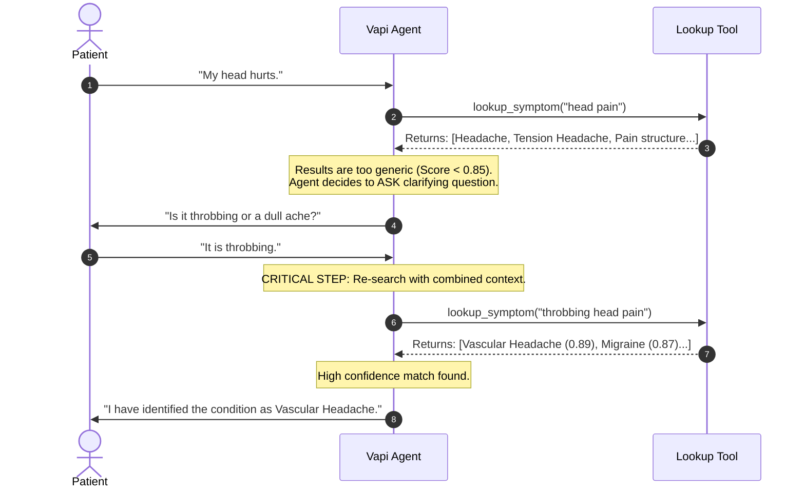

# AI Voice Triage Agent with SNOMED CT Vector Search

This project implements a real-time voice triage agent using **Vapi** for voice interaction, **FastAPI** for webhook processing, and **Memgraph** for vector-based semantic search over the **SNOMED CT** medical knowledge graph.

It features a **"Smart Loop"** architecture where the AI iteratively refines its search queries based on patient feedback to identify precise clinical concept IDs.

## Architecture

The system consists of three main components:
1.  **Voice Layer (Vapi):** Handles speech-to-text, TTS, and conversation logic (LLM).
2.  **Triage Engine (FastAPI):** Embeds user symptoms into vectors using `sentence-transformers`.
3.  **Knowledge Graph (Memgraph):** Stores SNOMED CT descriptions and performs cosine similarity vector searches.

### System Sequence Diagram



## The "Smart Loop" Logic

Unlike simple keyword matching, this agent uses an iterative **Search -> Refine -> Lock** loop to mimic clinical reasoning.



## Prerequisites

- **Docker Desktop** (Running)
- **Python 3.10+** (For local testing)
- **Ngrok** (To expose your localhost to Vapi)
- **Vapi Account** (For the Voice Agent)

## Quick Start

### 1. Clone & Setup

```bash
git clone
cd voice-gp
```

### 2. Configure Environment

Create a `.env` file in the root directory:

```ini
# .env
MEMGRAPH_HOST=health_memgraph
USE_GPU=false
```

### 3. Start Services

Run the complete stack using Docker Compose:

```bash
docker-compose up -d --build
```

This starts Memgraph (DB), Memgraph Lab (UI), the FastAPI Backend, and Ngrok.

### 4. Ingest SNOMED Data

Your database starts empty. Run the ingestion script inside the container to load the SNOMED nodes and generate embeddings.

```bash
# Takes ~5-10 minutes depending on dataset size - the docker compose can be adjusted to utilise GPU - 4090 RTX takes approx 2 hours to do embeddings
docker exec -it health_backend python ingest_final.py
```

### 5. Create Search Index

Once ingestion is complete, create the vector index:

```bash
docker exec health_memgraph mgconsole -c "CREATE VECTOR INDEX snomed_description_index ON :Description(embedding) WITH CONFIG {'dimension': 768, 'metric': 'cos', 'capacity': 1000000};"
```

## Connecting to Vapi

1.  **Get your Public URL:**
    Check your ngrok logs or dashboard (http://localhost:4040) to find your public URL.
    Example: `https://your-id.ngrok-free.app`

2.  **Define the Tool in Vapi:**
    Add a new tool to your Vapi Assistant:
    - **Name:** `lookup_symptom`
    - **Server URL:** `https://your-id.ngrok-free.app/triage`
    - **Schema:**

```json
{
  "type": "function",
  "function": {
    "name": "lookup_symptom",
    "parameters": {
      "type": "object",
      "properties": {
        "symptom": {
          "type": "string",
          "description": "The physical symptom findings (e.g. 'swollen knee'). Do not include cause of injury."
        }
      },
      "required": ["symptom"]
    }
  }
}
```

3.  **Update System Prompt:**
    Paste the "Smart Loop" prompt found in `prompts/system_prompt.txt` into your Vapi dashboard.

## Troubleshooting

| Issue | Cause | Fix |
| :--- | :--- | :--- |
| **404 Not Found** | URL mismatch | Ensure Vapi URL ends in `/triage` (no trailing slash). |
| **[] Empty Results** | DB empty or No Index | Run `ingest_final.py` and create the vector index. |
| **Method Not Allowed** | Browser test | The webhook expects POST. Use Invoke-RestMethod or Postman. |
| **Connection Refused** | Lab vs Docker | Use `localhost` in browser, but `health_memgraph` inside Docker code. |

## Project Structure

```plaintext
├── docker-compose.yml   # Orchestration for DB, Backend, Ngrok
├── Dockerfile           # Backend container definition
├── server.py            # FastAPI Webhook Server
├── ingest_final.py      # SNOMED Data Loader & Embedder
└── snomed/              # Place your SNOMED CONCEPT, DESCRIPTION, and RELATIONSHIP CSV files here
```